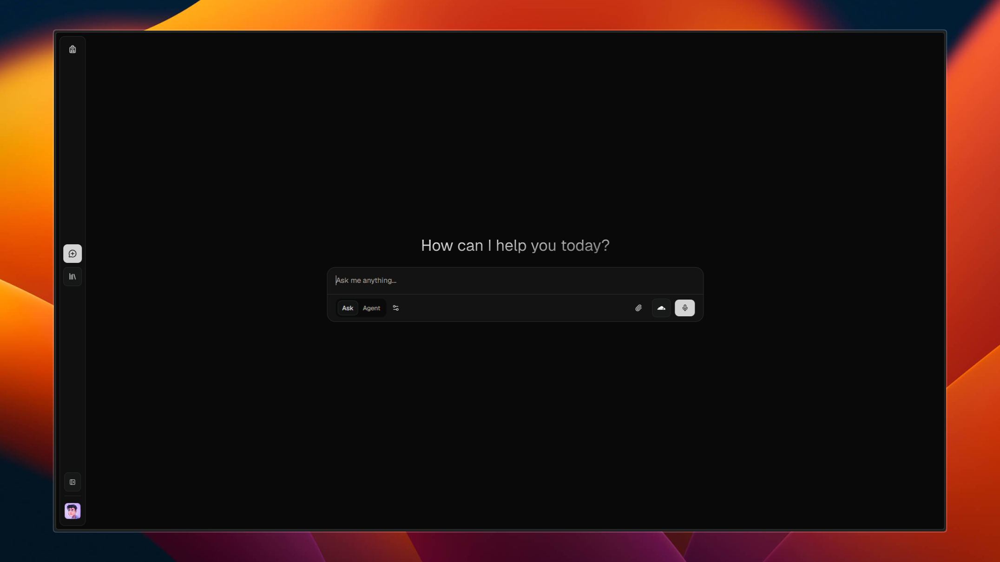
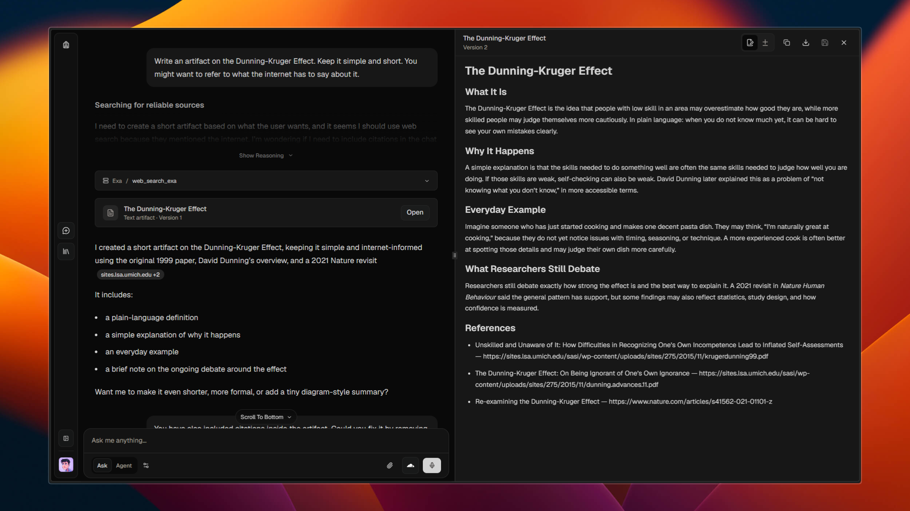

# Backpack

<p align="left">
  
  
</p>

Backpack is a modern, extensible research assistant and chat platform. It integrates multiple AI models, knowledge management, and real-time web/academic search to help users gather, organize, and interact with information efficiently.

## Prerequisites

- Bun
- Postgres-compatible database
- Redis
- Provider credentials for the AI/search/storage services you enable

## Setup

1. Install dependencies:

```powershell
bun install
```

2. Create a local environment file from the example:

```powershell
Copy-Item .env.example .env
```

3. Fill in `.env` with local credentials. Do not commit real secrets.

4. Apply database migrations:

```powershell
bun run db:migrate
```

5. Start the app:

```powershell
bun run dev
```

## Verification

Run the main local checks before shipping changes:

```powershell
bun run typecheck
bun run lint
bun run build
bun run audit
```
